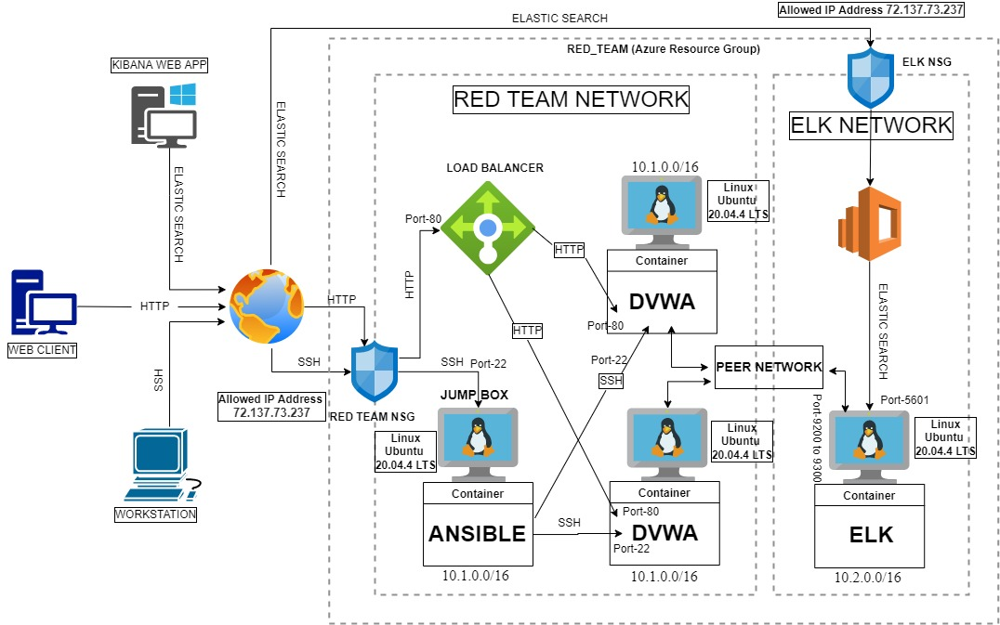

# The-CyberSecurity
Exploring and learning the Operations of CyberSecurity

## Automated ELK Stack Deployment

The files in this repository were used to configure the network depicted below.

These files have been tested and used to generate a live ELK deployment on Azure. They can be used to either recreate the entire deployment pictured above. Alternatively, select portions of the Filebeat playbook file may be used to install only certain pieces of it, such as Filebeat.

  - Config file for Ansible Container: [Ansible Config file](Ansible/ansible.cfg)
  - Config file for DVWA Hosts: [DVWA Hosts Config file](Ansible/hosts)
  - Playbook to Install DVWA Container: [DVWA playbook](Ansible/dvwa.yml)
  - Playbook to Install ELK Container: [ELK playbook](Ansible/install-elk.yml)
  - Config Playbook for Filebeat: [Filebeat Config playbook](Ansible/filebeat-config.yml)
  - Playbook to Install Filebeat: [Filebeat Installation playbook](Ansible/filebeat-playbook.yml)
  - Config Playbook for Metricbeat: [Metricbeat Config playbook](Ansible/metricbeat-config.yml)
  - Playbook to Install Metricbeat: [Metricbeat Installation playbook](Ansible/metricbeat-playbook.yml)

This document contains the following details:
- [Description of the Topology]
- [Access Policies]
- [ELK Configuration]
  - [Beats in Use]
  - [Machines Being Monitored]
- [How to Use the Ansible Build]

### Description of the Topology

The main purpose of this network is to expose a load-balanced and monitored instance of DVWA, the D*mn Vulnerable Web Application.

Load balancing ensures that the application will be highly available and redundant, in addition to restricting traffic overload to the network.
Load balancer reduces downtime by equally distributing traffic between servers and protects "availability" aspect of security.
Jump box sits in front of other machines in network so only Jump box is exposed to public internet.
Jump box controls access to other network machines by allowing traffic from specific addresses and then forwarding to network machines based on Security rules.

Integrating an ELK server allows users to easily monitor the vulnerable VMs for changes to the network and system logs and files.
  - What does Filebeat watch for?
  > Filebeat watch for files which are changed and when the changes are made. Filebeat starts one or more input to look for data logs in specified locations and for each log filebeat finds, it starts harvester which reads a single log for new content and sends the new log data to libbeat, which collects all the events and sends the aggregated data to the logstash or Elasticsearch for indexing.
  - What does Metricbeat record?
  > Metricbeat periodically records metrics from services and operating system running on the server like Apache, MySQL, Nginx, MongoDB, System module, HAProxy, PostgreSQL, Redis, Zookeeper. It collects all the metrics and statistics and forwards them to the Elasticsearch or Logstash.

The configuration details of each machine may be found below:

| Name     | Function          | IP Address | Operating System |
|----------|-------------------|------------|------------------|
| Jump Box | Gateway           | 10.1.0.4   | Linux            |
| WebVM1   | Web Server        | 10.1.0.5   | Linux            |
| WebVM2   | Web Server        | 10.1.0.6   | Linux            |
| ELK-VM   | Monitoring Server | 10.2.0.4   | Linux            |

### Access Policies

The machines on the internal network are not exposed to the public Internet. 

Only the Jump Box machine can accept connections from the Internet. Access to this machine is only allowed from the following IP addresses:
- Allowed Source IP Address inbound to Jump Box: 72.137.73.237

Machines within the network can only be accessed by My workstation with IP Address 72.137.73.237 through SSH into Jump Box and Jump Box have access to entire network.
Jump Box can SSH to ELK Server on port 22. My workstation with IP Address 72.137.73.237 can also access ELK Server on port 5601.

A summary of the access policies in place can be found in the table below.

| Name     | Publicly Accessible | Allowed IP Addresses                        | Open Ports          |
|----------|---------------------|---------------------------------------------|---------------------|
| Jump Box | Yes                 | 72.137.73.237                               | 22                  |
| WebVM1   | No                  | 10.1.0.4                                    | 80, 22              |
| WebVM2   | No                  | 10.1.0.4                                    | 80, 22              |
| ELK-VM   | Yes                 | 72.137.73.237, 10.1.0.4, 10.1.0.5, 10.1.0.6 | 5601, 22, 9200-9300 |

### Elk Configuration

Ansible was used to automate configuration of the ELK machine. No configuration was performed manually, which is advantageous because it reduces potential for human error and also simplifies to configure many machines identically at same time.

The playbook implements the following tasks:
- 
- ...

The following screenshot displays the result of running `docker ps` after successfully configuring the ELK instance.

### Target Machines & Beats
This ELK server is configured to monitor the following machines:
- _TODO: List the IP addresses of the machines you are monitoring_

We have installed the following Beats on these machines:
- _TODO: Specify which Beats you successfully installed_

These Beats allow us to collect the following information from each machine:
- _TODO: In 1-2 sentences, explain what kind of data each beat collects, and provide 1 example of what you expect to see. E.g., `Winlogbeat` collects Windows logs, which we use to track user logon events, etc._

### Using the Playbook
In order to use the playbook, you will need to have an Ansible control node already configured. Assuming you have such a control node provisioned: 

SSH into the control node and follow the steps below:
- Copy the _____ file to _____.
- Update the _____ file to include...
- Run the playbook, and navigate to ____ to check that the installation worked as expected.

_TODO: Answer the following questions to fill in the blanks:_
- _Which file is the playbook? Where do you copy it?_
- _Which file do you update to make Ansible run the playbook on a specific machine? How do I specify which machine to install the ELK server on versus which to install Filebeat on?_
- _Which URL do you navigate to in order to check that the ELK server is running?

_As a **Bonus**, provide the specific commands the user will need to run to download the playbook, update the files, etc._
